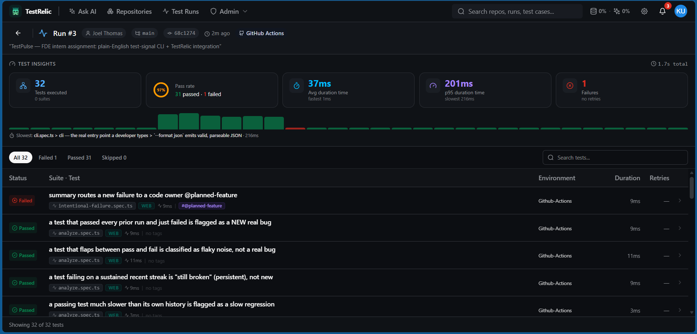

# TestRelic Dashboard — real ingested run

Part 3 requires a real TestRelic cloud run from this repo's own test suite. The data
below is genuine: it was uploaded by `@testrelic/playwright-analytics` from a GitHub
Actions run of `npm test` (Node 20), with `TESTRELIC_API_KEY` provided as a repo secret.

- **Project / repo:** `testpulse-fde`
- **Trigger:** GitHub Actions · commit `68c1274` on `main`
- **Run link:** https://platform.testrelic.ai/dashboards/runs/2880c72e-ac04-4ecf-b67d-14454f3f8b56?repoId=9b744114-f275-4f6f-9545-fa68b407aaa1&runNumber=3

## What the dashboard shows

- **32 tests executed**, **97% pass rate** — 31 passed · 1 failed · 0 skipped · no retries.
- Total **2.3s**, avg **37ms**, p95 **201ms** (slowest: the `--format json` CLI subprocess test).
- **1 failure**, surfaced at the top of the grid:
  `intentional-failure.spec.ts › summary routes a new failure to a code owner @planned-feature`
  — the deliberately-failing test (tagged `@planned-feature`), demonstrating the full
  failure → AI-analysis loop.
- Recognizable, meaningful test names across `analyze`, `cli`, `parse`, `plain-english`,
  and `summarize` specs — the grid tells the story of what TestPulse actually verifies.

