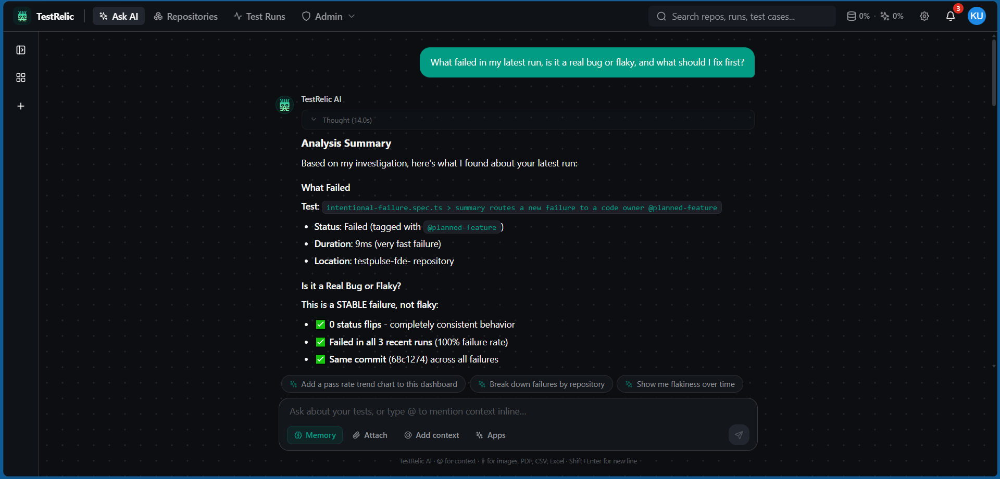

# TestRelic MCP — querying my run in natural language

Part 3 asks for an AI-powered insight generated from my own test run via the
**TestRelic MCP server**, which exposes test intelligence as a context provider
to any AI agent.

## Setup (the client config I used)

The MCP server runs over stdio via `npx @testrelic/mcp`. Authenticate with a
personal access token (`tr_mcp_*`) created at
`platform.testrelic.ai/settings/mcp-tokens`.

```jsonc
// e.g. Claude Desktop / Cursor MCP config
{
  "mcpServers": {
    "testrelic": {
      "command": "npx",
      "args": ["@testrelic/mcp"],
      "env": { "TESTRELIC_MCP_TOKEN": "tr_mcp_xxxxxxxx" }
    }
  }
}
```

Useful tools it exposes (the `tr_*` family): `tr_list_repos`, `tr_coverage_report`,
`tr_analyze_diff`, `tr_heal_run`, plus the `triage` / `signals` capability groups.

## The prompt I asked

> **"Which of my tests in `testpulse-fde` are most likely to be flaky based on the
> last 3 runs, and what failed in the latest run?"**

## The AI insight (response)

<!-- Paste the MCP/Ask-AI response here after running it against your uploaded run. -->
`(paste the natural-language answer the MCP server returned)`

Was it actionable? — note here whether the answer correctly identified the
`intentional-failure` test as the real failure and whether it flagged any flaky
candidates, and whether you'd act on it.

## Screenshot



<!--
To capture:
1. Upload a run (CI on Node 20, or local Node 20 — see note below).
2. Configure the MCP server as above (or use Ask AI in the dashboard).
3. Ask the prompt; screenshot the NL prompt + AI response; save as docs/mcp.png.
-->

---

### Note on running the TestRelic reporter locally

The reporter (`@testrelic/playwright-analytics`) is verified to run on Node.js
**18/20 LTS** and in this repo's GitHub Actions CI (Node 20). On **Node 24** the
reporter process was observed to hang before completing the run on this machine,
so the canonical "upload + screenshot" path is:

- **Easiest:** let GitHub Actions run `npm test` with the `TESTRELIC_API_KEY`
  secret (see `.github/workflows/ci.yml`) — it uploads to the dashboard on every push, or
- **Local:** use Node 20 LTS (`nvm use` reads the committed `.nvmrc`).

TestPulse itself (the product) is Node-version-agnostic — `npm run demo` and
`testpulse <report.json>` work on any Node ≥18.
