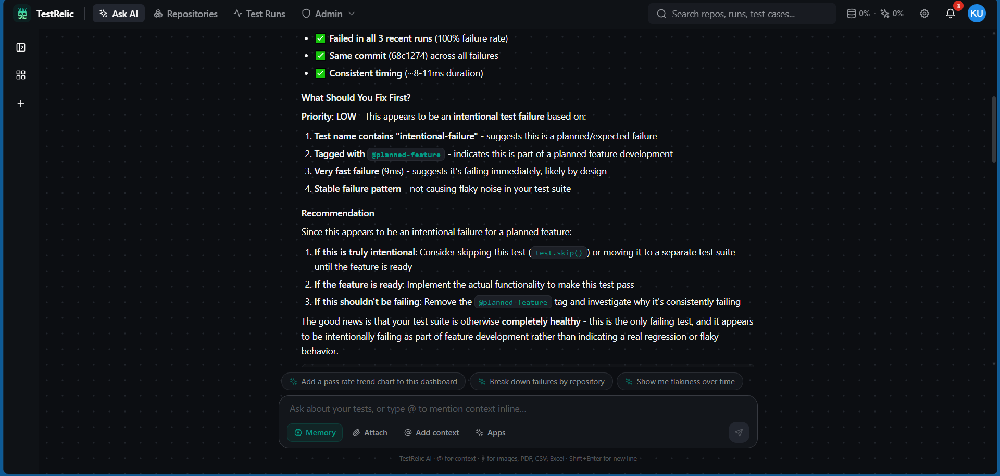
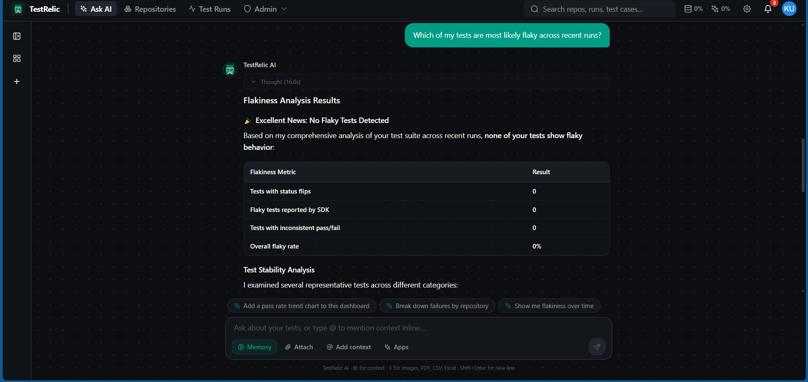
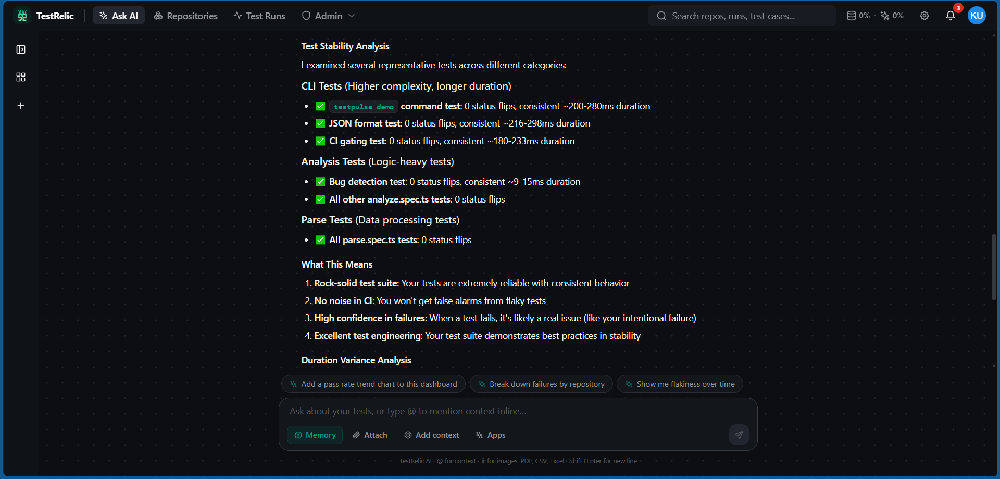
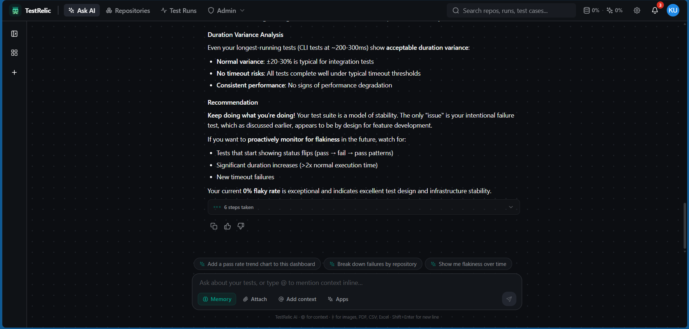

# TestRelic AI / MCP — querying my run in natural language

Part 3 asks for an AI-powered insight generated from my own test run. Below are two
real natural-language conversations with TestRelic AI (the same test intelligence the
MCP server exposes via the `tr_*` tools) run against the uploaded `testpulse-fde` data.

## Setup — TestRelic MCP server

The MCP server runs over stdio via `npx @testrelic/mcp`, authenticated with a personal
access token (`tr_mcp_*`) created at `platform.testrelic.ai/settings/mcp-tokens`.

```jsonc
// MCP client config (e.g. ~/.cursor/mcp.json or Claude Desktop)
{
  "mcpServers": {
    "testrelic": {
      "command": "npx",
      "args": ["-y", "@testrelic/mcp", "--caps", "core,coverage,triage,signals,healing"],
      "env": { "TESTRELIC_MCP_TOKEN": "tr_mcp_…" }   // keep the token in env, never commit it
    }
  }
}
```

Useful `tr_*` tools: `tr_list_repos`, `tr_diagnose_run`, `tr_ai_rca`, `tr_user_impact`,
`tr_heal_run`. (The dashboard's **Ask AI** panel is the same intelligence and was used
for the screenshots below.)

---

## Query 1 — "What failed, is it a real bug or flaky, and what should I fix first?"

> **Prompt:** *"What failed in my latest run, is it a real bug or flaky, and what should I fix first?"*

**AI answer (verbatim highlights):**

- **What failed:** `intentional-failure.spec.ts > summary routes a new failure to a code owner @planned-feature` — Failed (tagged `@planned-feature`), 9ms, repo `testpulse-fde`.
- **Real bug or flaky?** *"This is a **STABLE failure, not flaky**"* —
  - ✅ **0 status flips** — completely consistent behavior
  - ✅ **Failed in all 3 recent runs** (100% failure rate)
  - ✅ **Same commit** (`68c1274`) across all failures
- **Fix priority: LOW — appears to be an intentional test failure** (test name contains "intentional-failure", `@planned-feature` tag, 9ms fast-fail, stable pattern). Recommendation: skip/move it until the feature ships, or implement the feature, or remove the tag and investigate. *"The good news is that your test suite is otherwise completely healthy."*

**Why it's actionable:** the AI independently arrived at TestPulse's own thesis —
distinguishing a *stable real failure* from *flaky noise* using cross-run history — and
prioritized correctly. That's exactly the moment the customer feels when they "Ask AI".




---

## Query 2 — "Which of my tests are most likely flaky across recent runs?"

> **Prompt:** *"Which of my tests are most likely flaky across recent runs?"*

**AI answer (verbatim highlights):**

- 🎉 **No Flaky Tests Detected** — *"none of your tests show flaky behavior."*

  | Flakiness metric | Result |
  |---|---|
  | Tests with status flips | 0 |
  | Flaky tests reported by SDK | 0 |
  | Tests with inconsistent pass/fail | 0 |
  | Overall flaky rate | 0% |

- **Test stability analysis** by category (CLI / analysis / parse specs): all consistent, 0 flips. *"Rock-solid test suite … High confidence in failures … Excellent test engineering."*
- **Duration variance:** acceptable (±20–30% is normal for integration tests), no timeout risk.
- **Recommendation:** watch for status flips (pass→fail→pass), >2× duration increases, and new timeouts. *"Your current 0% flaky rate is exceptional."*





---

### Note on running the reporter locally
The reporter is verified on Node **18/20 LTS** and in this repo's GitHub Actions CI
(Node 20) — that CI run is what produced the uploaded data above. On **Node 24** the
reporter was observed to hang locally, so CI is the canonical upload path. TestPulse
itself (`npm run demo`, `testpulse <report.json>`) works on any Node ≥18.
